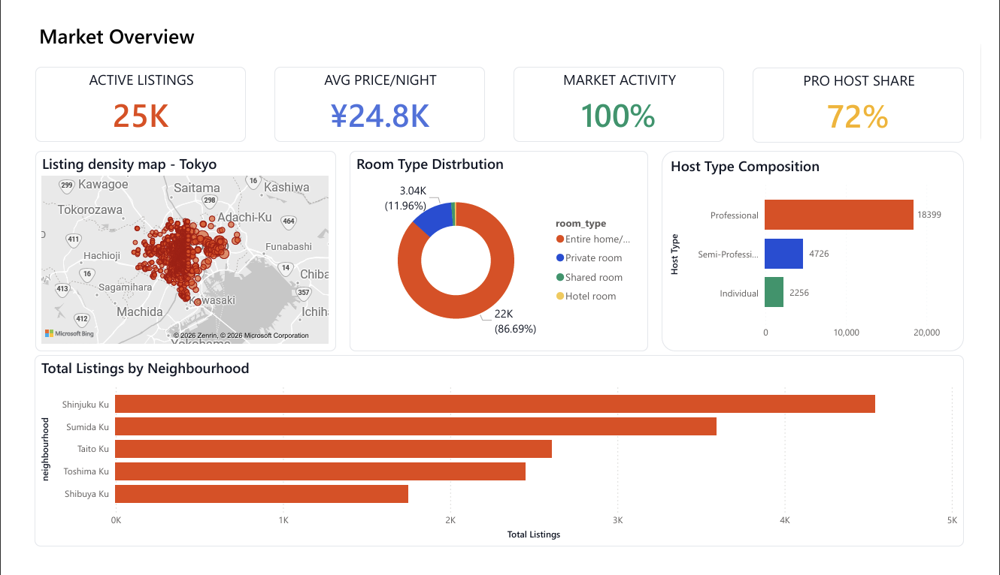
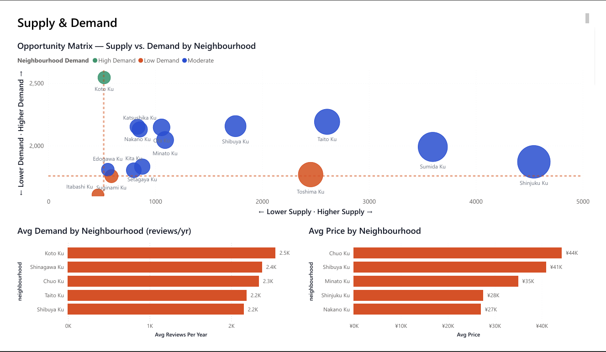

# tokyo-airbnb-analysis

Exploratory data analysis of 25,381 Airbnb listings across 
47 Tokyo neighbourhoods using Power BI, SQL, and Excel.

---

## 📊 Dashboard Preview

---

## 🎯 Project Objective

Identify supply and demand imbalances across Tokyo 
neighbourhoods to surface actionable opportunities for 
host acquisition and market growth strategy.

---

## 🔍 Key Findings

| Finding | Detail |
|---|---|
| Top demand neighbourhood | Koto Ku (2,500 avg reviews/yr) |
| Most oversupplied | Shinjuku Ku (4,500+ listings, low demand) |
| Highest avg price | Chuo Ku at ¥44,000/night |
| Professional host share | 72.5% of all listings |
| Market activity rate | 100% of listings active in LTM |

---

## 🛠️ Tools Used

- **Power BI Desktop** — dashboard and visualisation
- **Power Query** — data cleaning and transformation
- **DAX** — calculated measures and columns
- **SQL** — initial data exploration

---

## 📐 Methodology

1. Data sourced from Inside Airbnb
2. Cleaned in Power Query — fixed data types, 
   removed null coordinates, filtered outliers
3. DAX measures created for demand scoring 
   and neighbourhood classification
4. Neighbourhoods filtered to 200+ listings 
   minimum for statistical relevance
5. Opportunity matrix built using supply vs 
   demand scatter with bubble size = listing count

---

## ⚠️ Limitations

- `reviews_per_month` used as demand proxy — 
  actual booking data not publicly available
- Price reflects listed rate, not realised rate
- Single point-in-time snapshot
- Rural suburbs excluded as market outliers

---

## 📂 Data Source

[Inside Airbnb — Tokyo](https://insideairbnb.com/tokyo)

---

## 🔗 Full Write-up

[View on Notion](paste-your-notion-link-here)
